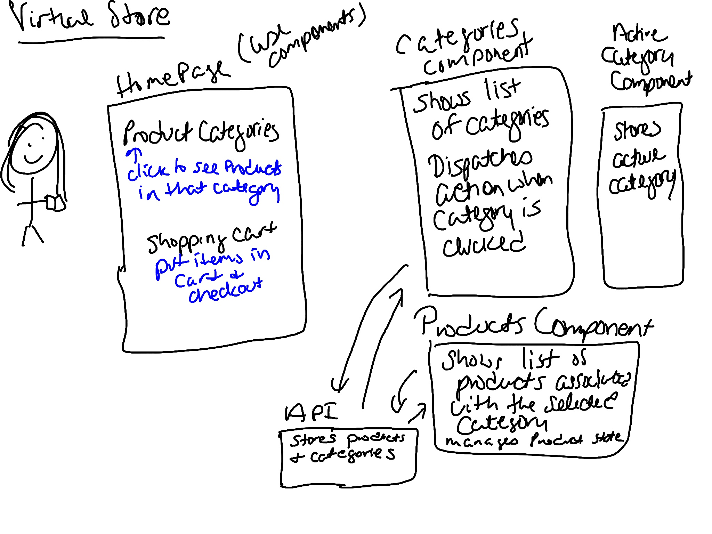

# virtual-store
This project contains a virtual store application.

### Author: Marlene Rinker

- [Submission PR](https://github.com/marlenerinker-401-advanced-javascript/virtual-store/pull/3)
<!-- - [Tests Report](https://github.com/marlenerinker-401-advanced-javascript/resty/actions)
- [GitHub Pages deployment](https://marlenerinker-401-advanced-javascript.github.io/resty/) -->

### Setup

#### `.env` requirements
None at this time

#### Packages to Install
(See package.json)

- node-sass
- react
- react-dom
- react-scripts
<!-- - react-router-dom -->
<!-- - uuid -->
<!-- - react-jsonschema-form -->
<!-- - react-bootstrap -->
<!-- - bootstrap -->
- enzyme
- enzyme-adapter-react-16
- react-test-renderer 
- eslint-plugin-react
- redux
- redux-devtools-extension
- @material-ui/core
- @material-ui/icons
<!-- - axios -->
<!-- - react-bootstrap-4-pagination -->
<!-- - dotenv -->
<!-- - react-cookies -->
<!-- - jsonwebtoken -->

#### Running the app
npm start

#### Tests

- Unit Tests: `npm test` (run from the `__tests__` folder to run all tests) -->

- Assertions Made:
  - Products will render correctly
  - Categories will render correctly

#### UML

#### Citations
Got help from Paul Depew and Ashley Biermann with styling using materials-ui